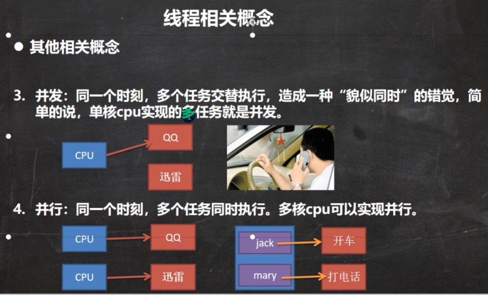

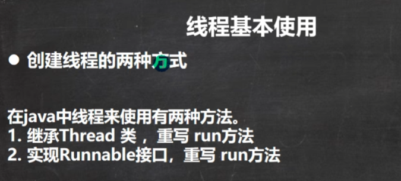

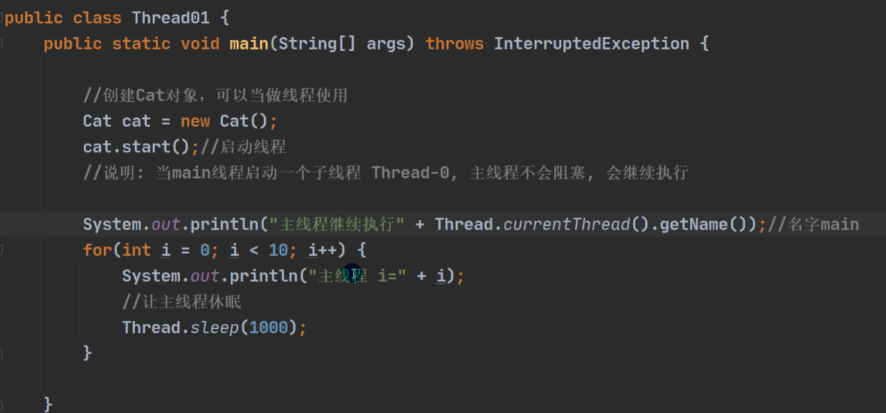

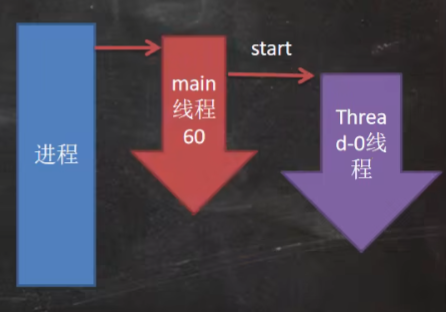

主线程（main）结束了，进程不一定结束。

所有的线程结束了，进程才会结束。

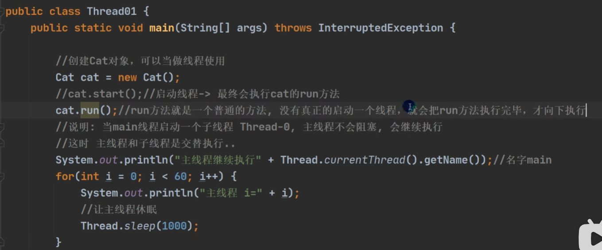

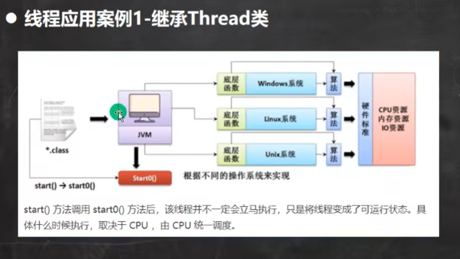

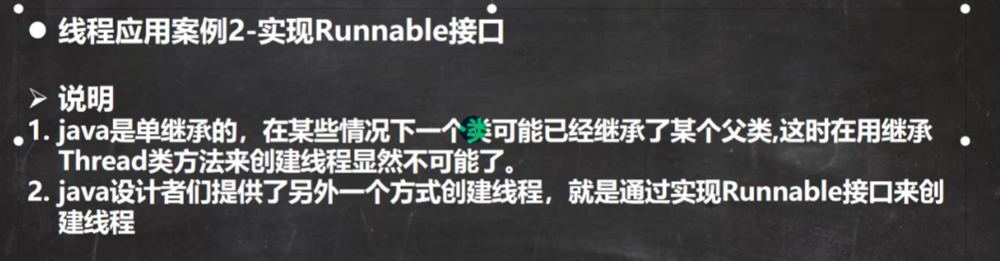

这里底层使用了一种设计模式，叫做静态代理。

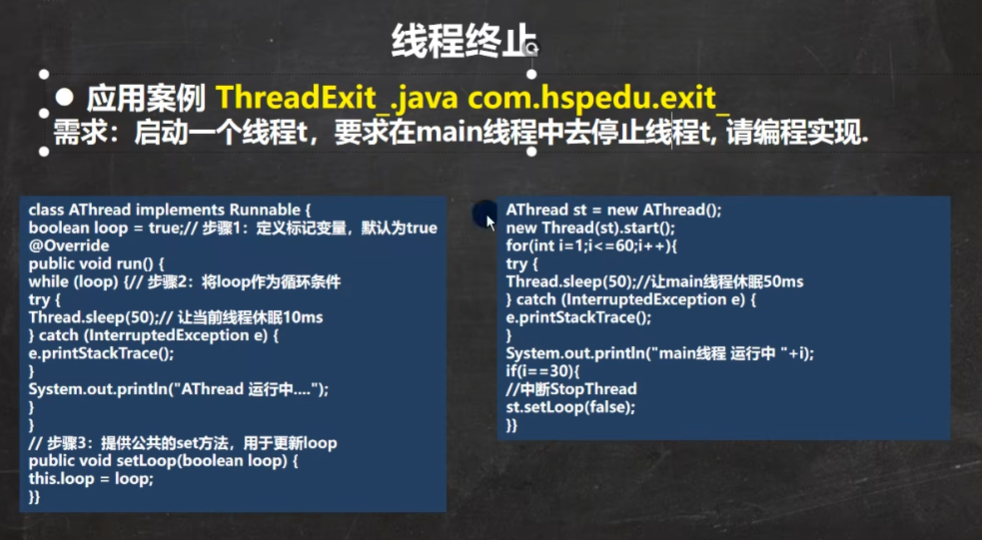

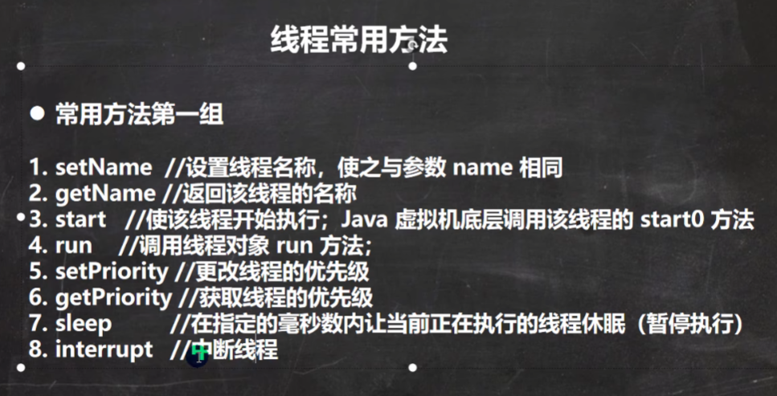

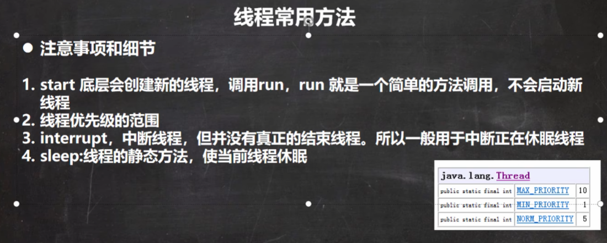

interrupt()不是终止，是终断，会抛出一个InterruptException。

如果因为一些特殊的原因，想提前中断一些阻塞的线程，以让他们提前解除阻塞状态，然后继续执行下去。只需要在其他线程调用指定线程的interrupt()方法即可（interrupt()方法是线程实例方法），这时候原来阻塞的对应的线程就会抛出InterruptException异常，通过catch捕获异常就可以继续往下面执行了。

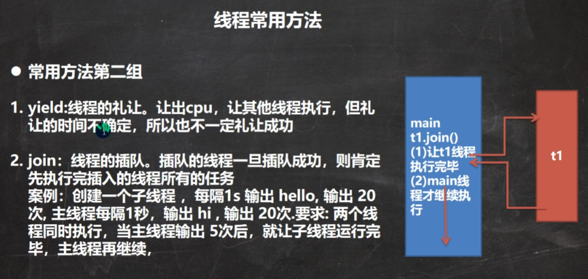