变量表示内存中的一个存储区域。不同的变量，类型不同，占用空间大小不同。(int 4字节，double 8字节)  
1 byte = 8 bit

+号：当左右两边有一方为字符串时，则做拼接运算。

```
System.out.println(100 + 3 + "hello"); //103hello
System.out.println("hello" + 100 +3); //hello1003
```

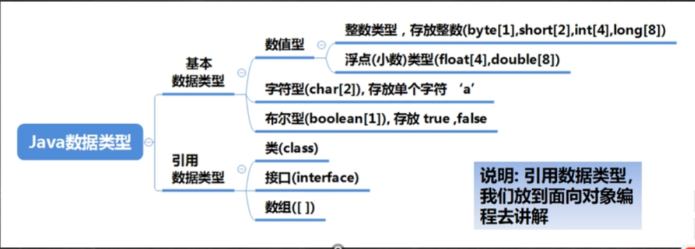


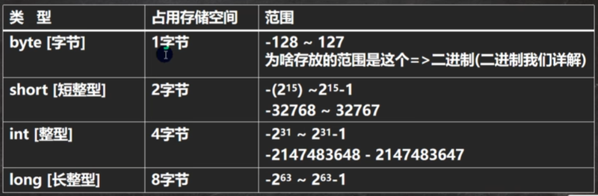

Java的整型常量（具体值）默认为int型，声明long型常量须后面加'l'或者'L'。


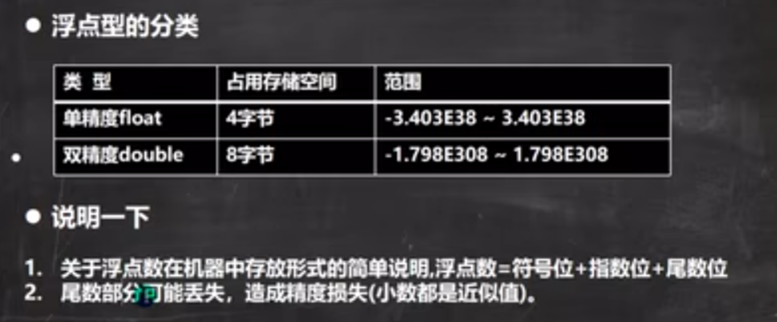

Java的浮点型常量（具体值）默认为double型，声明float型常量后面须后面加'f'或者'F'。  
double型默认后面加'd'或者"D"。

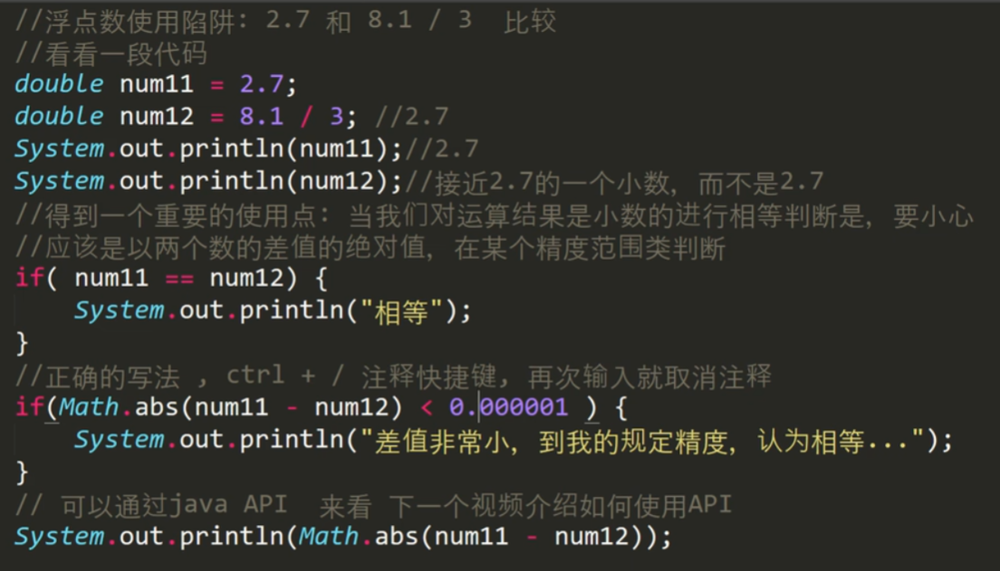

API (Application Programming Interface)

''表示字符  
""表示字符串

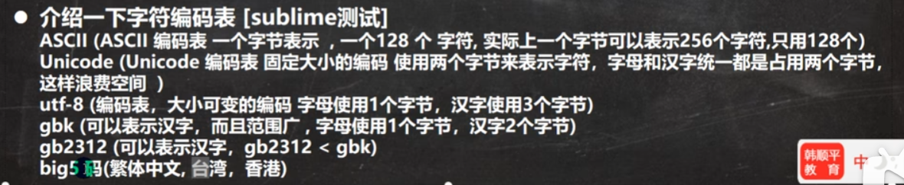

不可以用0或非0的整数替代false和true，这与C语言不同。

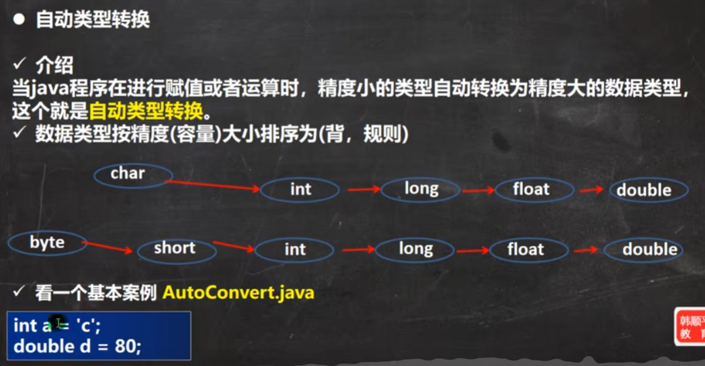

自动类型转换：  
1. 有多种类型数据混合运算时，系统首先自动将所有数据转换成容量最大的那种数据类型，然后在进行计算。
2. 表达式结果的类型自动提升为操作数中最大的类型。
3. (byte, short)和char不会自动转换。
4. byte, short, char他们三者可以计算，单独计算或者两两运算时都会转换为int。
   ```
   byte b1 = 1;
   byte b2 = 2;
   byte b3 = b2 + b3; //错误：b2 + b3 => int
   ```

基本类型转String类型： 通过+  
String类型转基本数据类型： 调用包装类parseXX方法

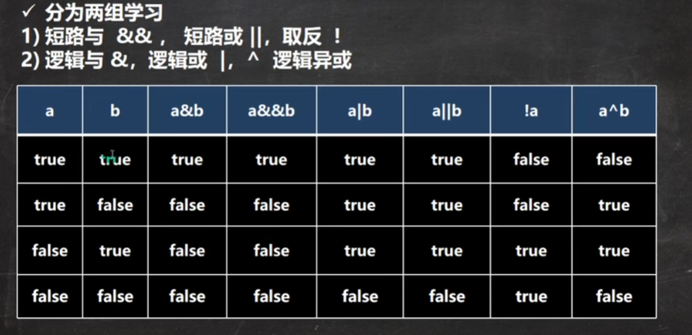

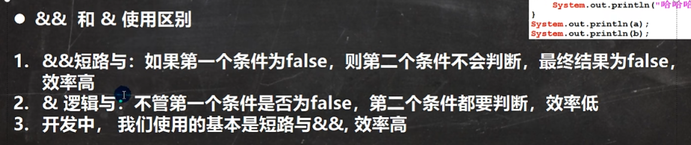

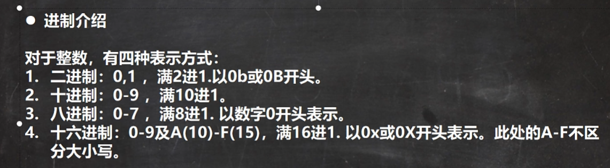

1. java没有无符号数，换言之，java中的数都是有符号数。
2. 在计算机运算的时候，都是以补码的方式来运算的。
3. 当我们看运算结果的时候，要看它的原码。

a % b 等同于 a - a / b * b  
当a是小数时， a - (int)a / b * b

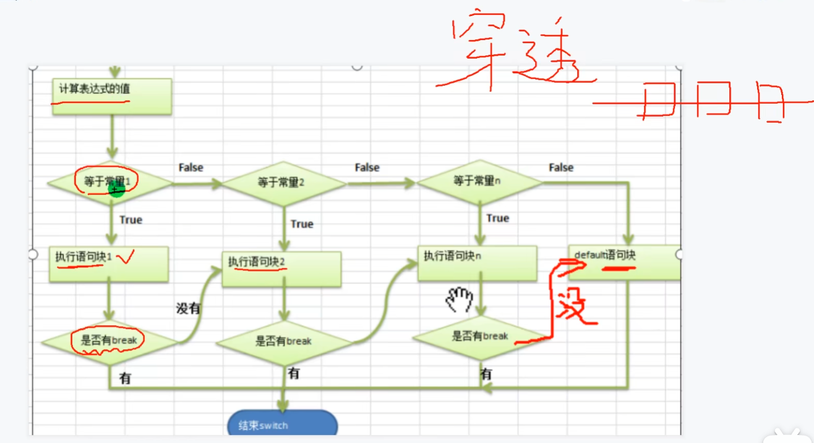

如果switch语句中没有break，注意“穿透”现象。

switch(表达式)中表达式的返回值必须是：byte, short, int, char, enum, String之一。  
case子句中的值必须时常量。

数组创建后，如果没有赋值，有默认值。  
int 0, short 0, byte 0, long 0, float 0.0, double 0.0, char \u0000, boolean false, String null

数组在默认情况下是引用传递，赋的值是地址。

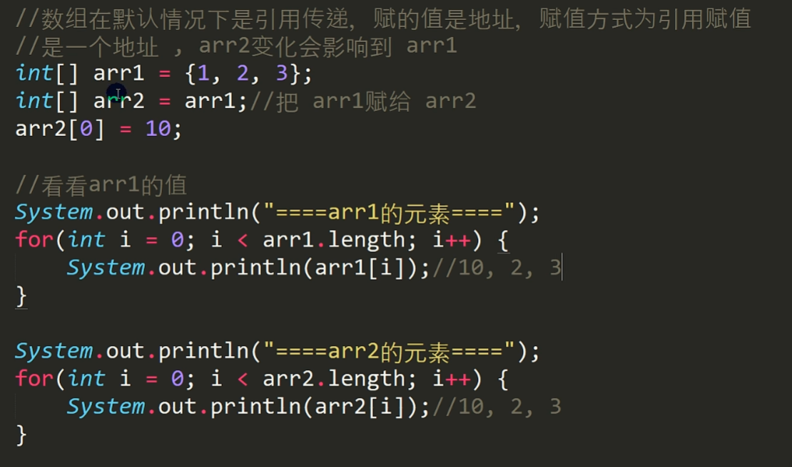

**值传递和引用传递的区别**

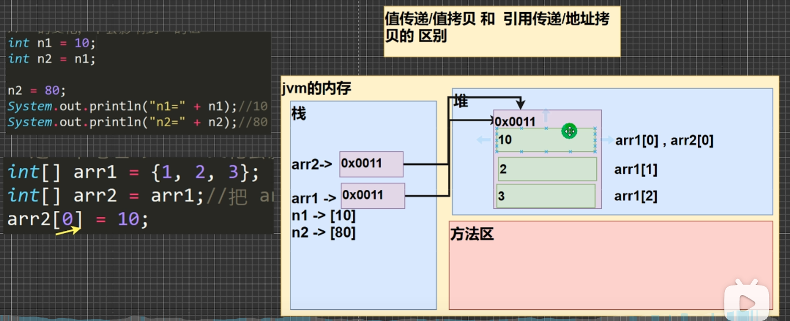

深拷贝

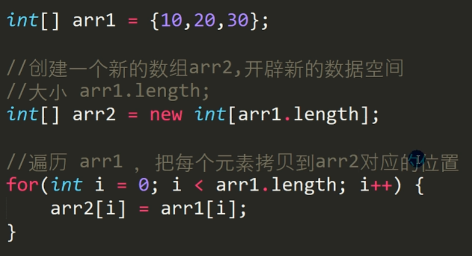

字符串的比较用equals()

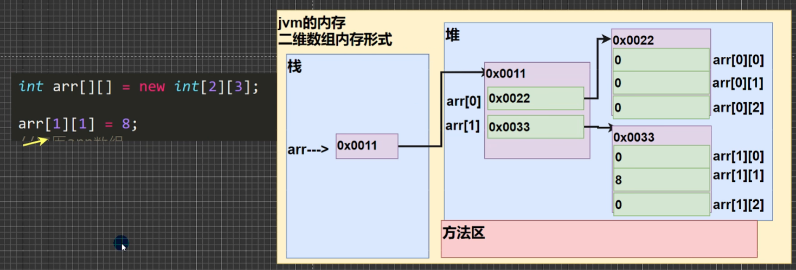

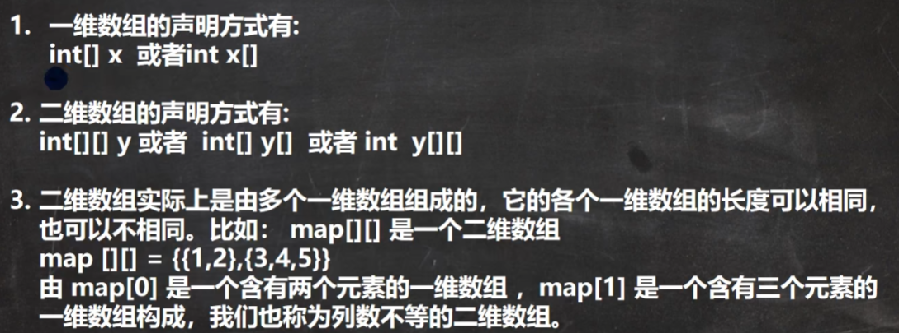