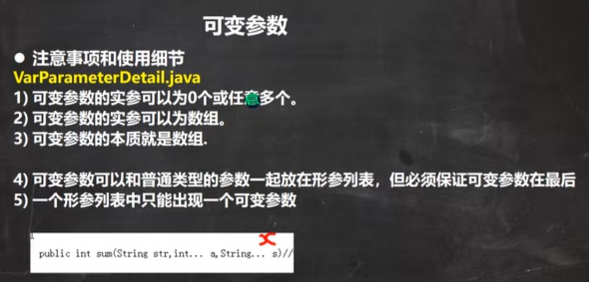

属性（成员变量）如果不赋值，有默认值，规则和数组一致。

**Java成员变量（包括普通成员变量和静态变量）有默认值，可以不初始化；但局部变量必须要初始化。**

访问修饰符有四种：public, protected, private, 默认。如果不写访问修饰符就是默认。

一个方法只有一个返回值。（如何返回多个结果？返回数组）

基本数据类型，传递的是值（值拷贝），形参的任何改变不影响实参。

引用类型传递的是地址（传递的也是值，但是值是地址），可以通过形参影响实参。

可以通过输出对象的hashCode看看对象是否是同一个。

一个类可以定义多个不同的构造器，即构造器的重载。

在创建对象时，系统会自动调用该类的构造方法。

如果程序员没有定义构造器，系统会自动给类生成一个默认无参构造方法，比如Person(){}，可以使用javap指令反编译看看。

一旦定义了自己的构造器，默认的构造器就覆盖了，就不能再使用默认的无参构造器了，除非显式的定义一下。

  
**如果有this(参数列表)这种语法必须放在第一条语句**

idea快捷键：
1. 快速格式化ctrl+alt+l
2. 查看一个类的层级关系ctrl+h
3. 定位到方法ctrl+单击
4. 自动分配变量名加.var

idea模板：
1. main
2. sout
3. fori

继承细节：
1. 子类必须调用父类的构造器，完成父类的初始化。
2. super()作用是默认调用父类的无参构造器，写不写都有。
3. 当创建子类对象时，不管使用子类的哪个构造器，默认情况下总会去调用父类的无参构造器，如果父类没有提供无参构造器，则必须在子类的构造器中用super去指定使用父类的哪个构造器完成对父类的初始化工作，否则，编译不通过。
4. 如果希望指定去调用父类的某个构造器，则显式的调用一下：super(参数列表)。
5. super在使用时，需要放在构造器第一行。
6. super()和this()都只能放在构造器第一行，因此这两个方法不能共存。
7. Object是所有类的父类。
8. 父类构造器的调用不限于直接父类，将一直往上追溯到Object类。
9. java中是单继承机制。

