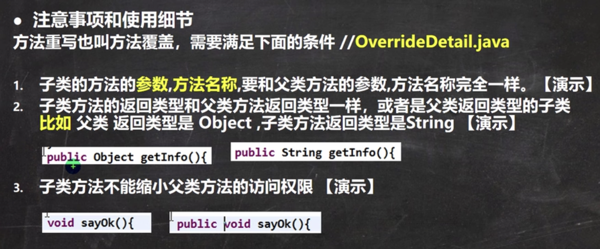

多态包括方法多态和对象多态。

重写和重载体现方法的多态。

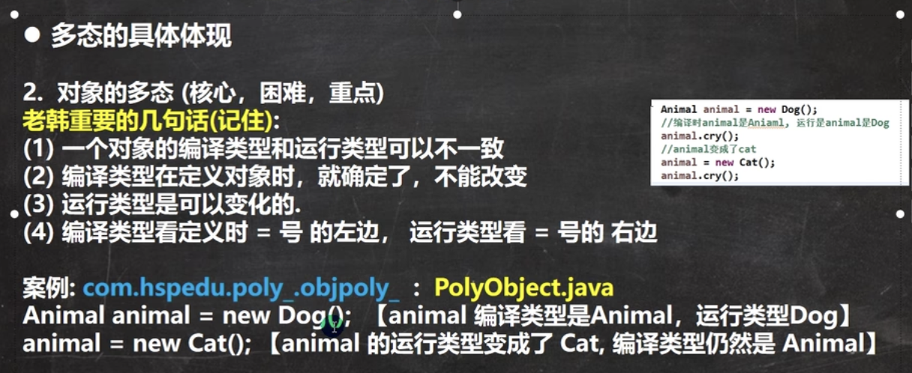

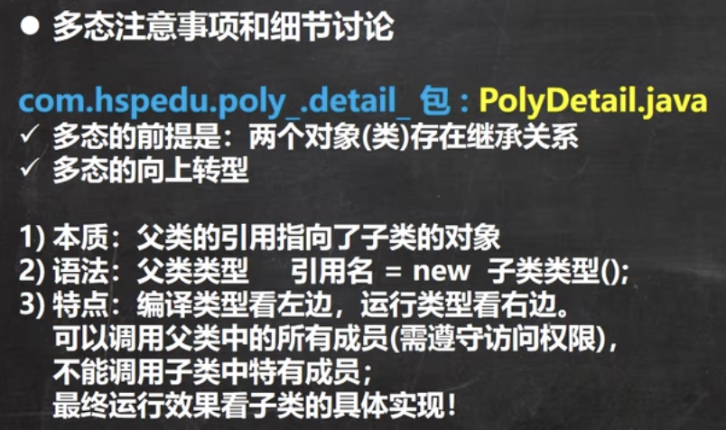

**不能调用子类中的特有成员**

**因为在编译阶段能调用哪些成员是由编译类型决定的**

**最终运行效果看子类的具体实现**

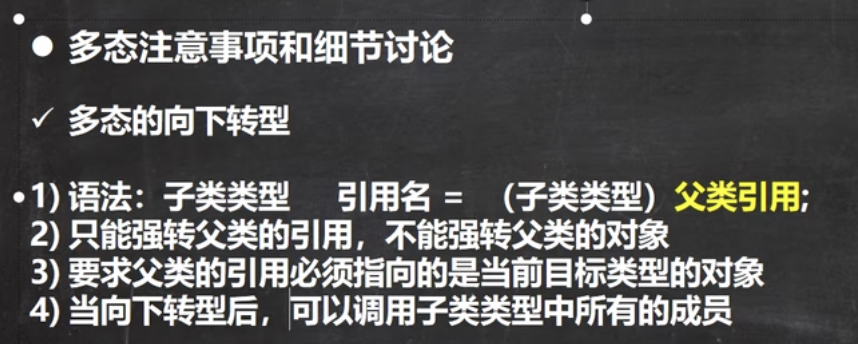

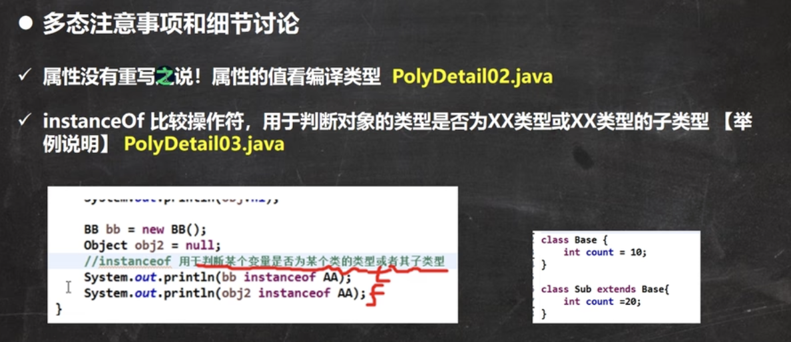

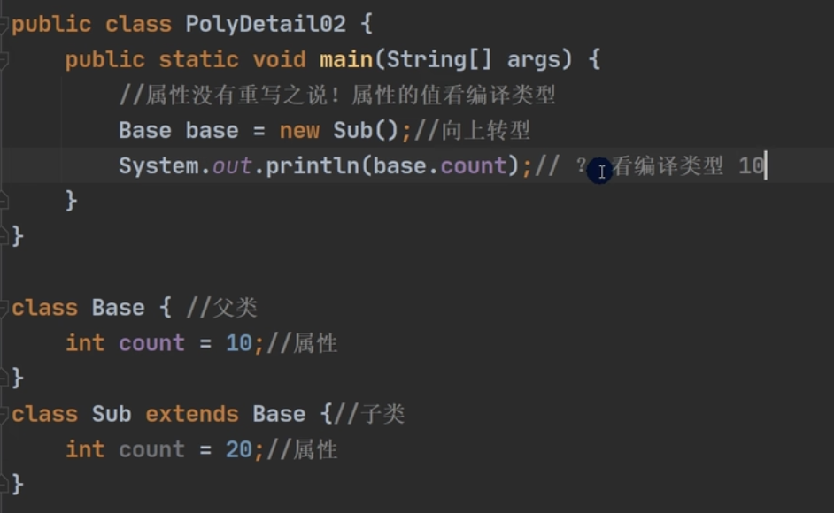

instanceOf用于判断对象的**运行**类型是否为XX类型或XX类型的自类型。

属性看编译类型，方法看运行类型。

**动态绑定**

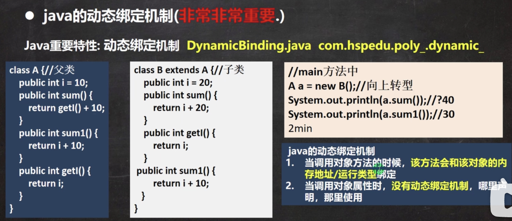

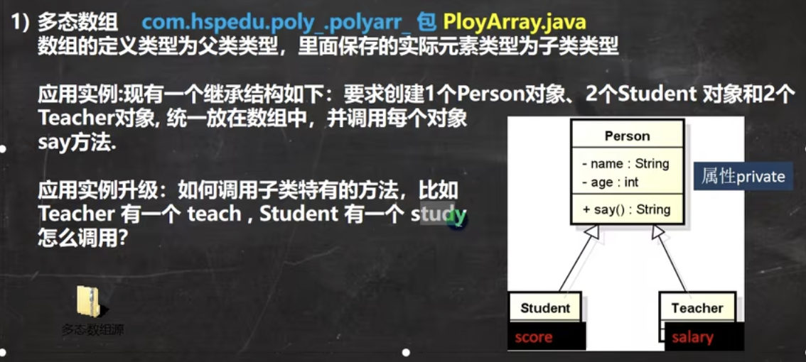

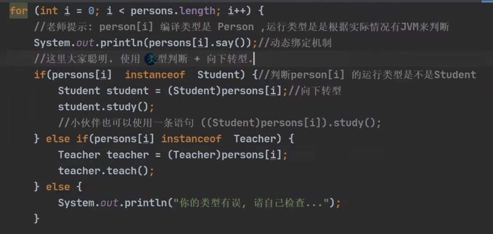

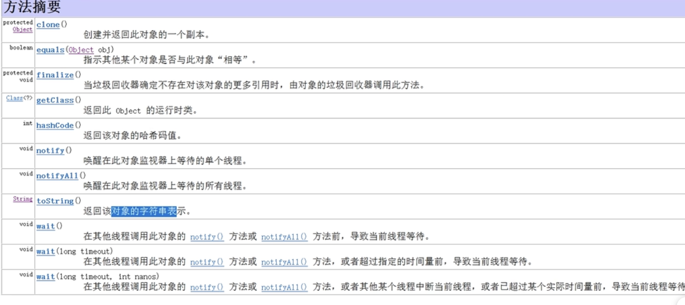

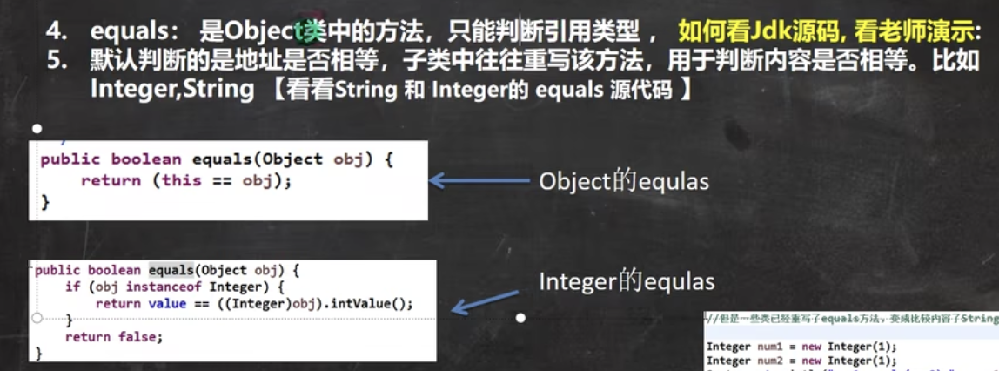

哈希值主要是根据地址来的，但哈希值不完全等于地址。