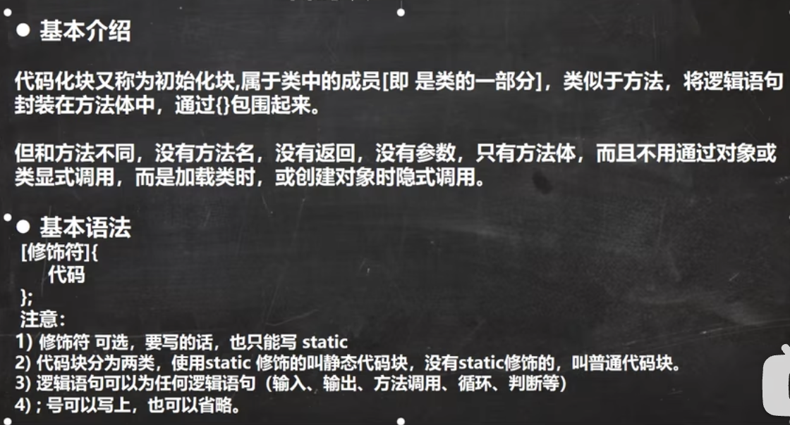

代码块比构造器先被调用。

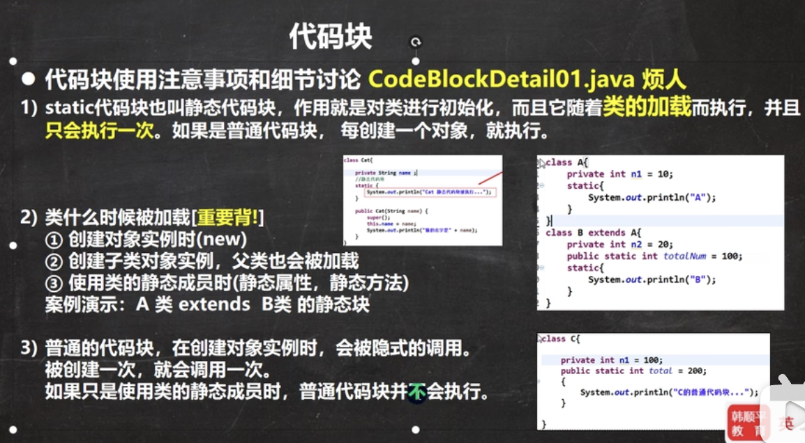

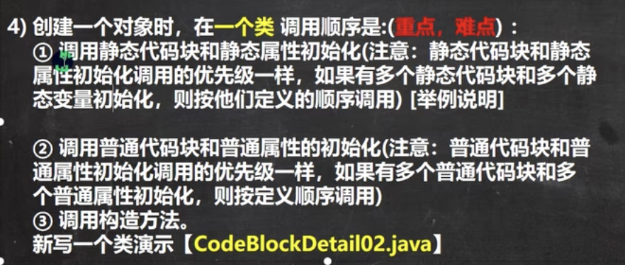

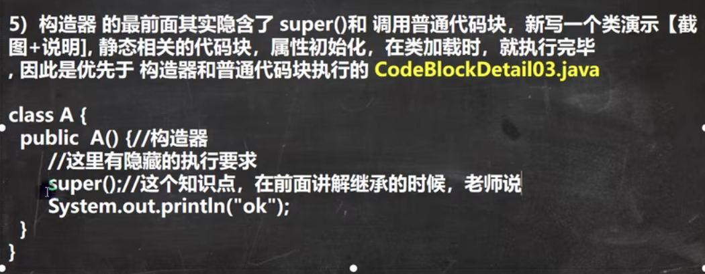

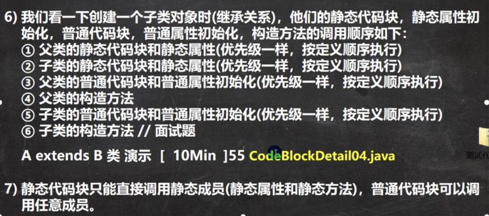

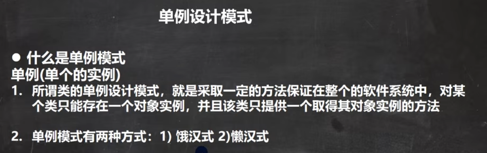

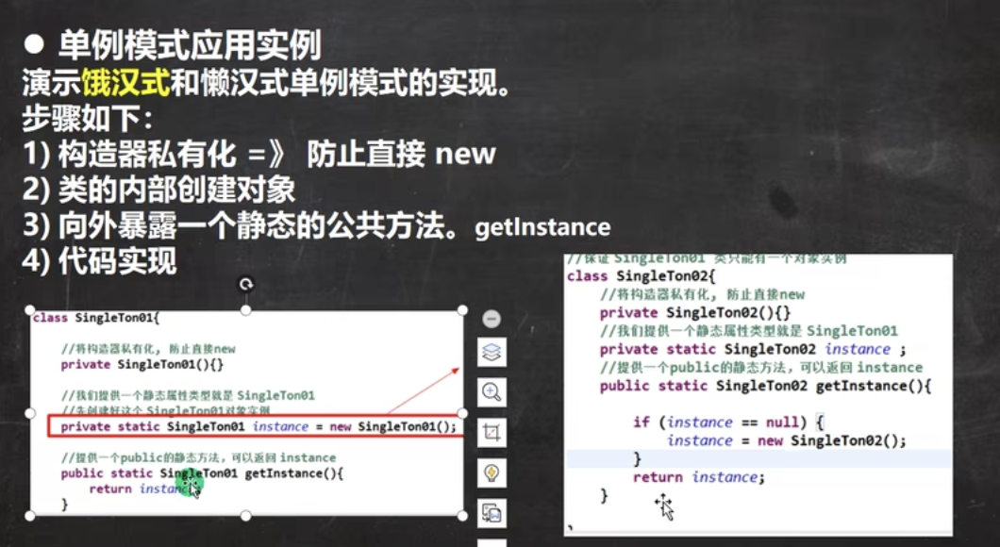

饿汉式可能造成创建了对象，但没有使用。

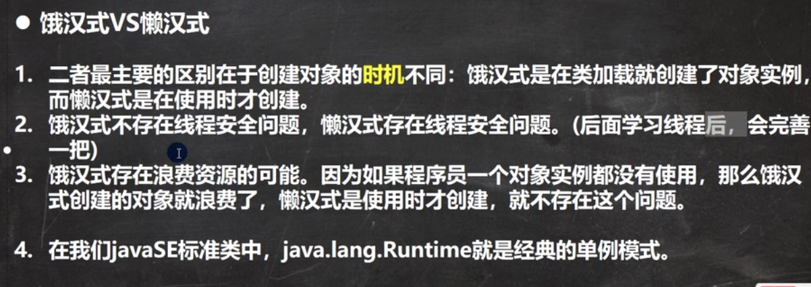

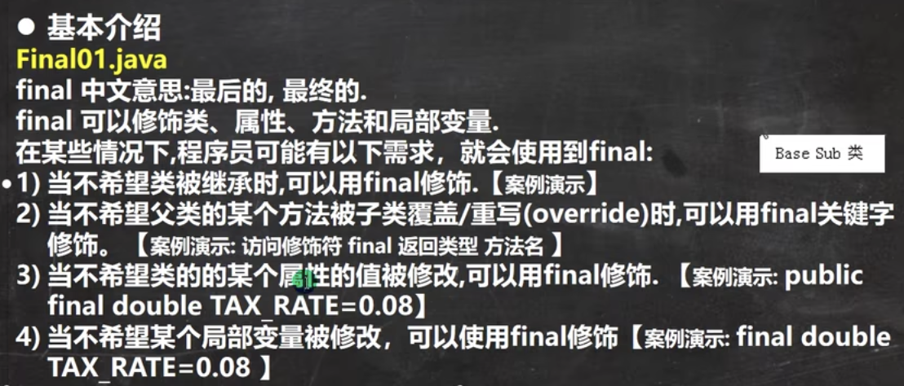

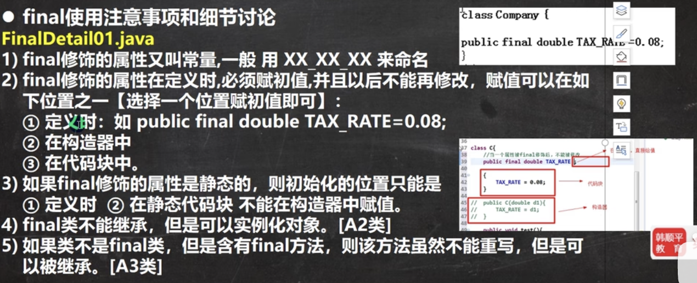

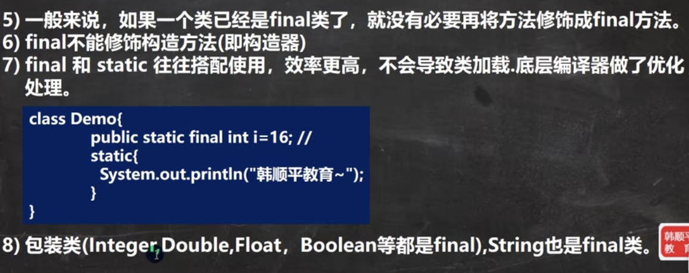

当父类的某些方法，需要声明，但又不确定如何实现时，可以将其声明为抽象方法，那么这个类就是抽象类。

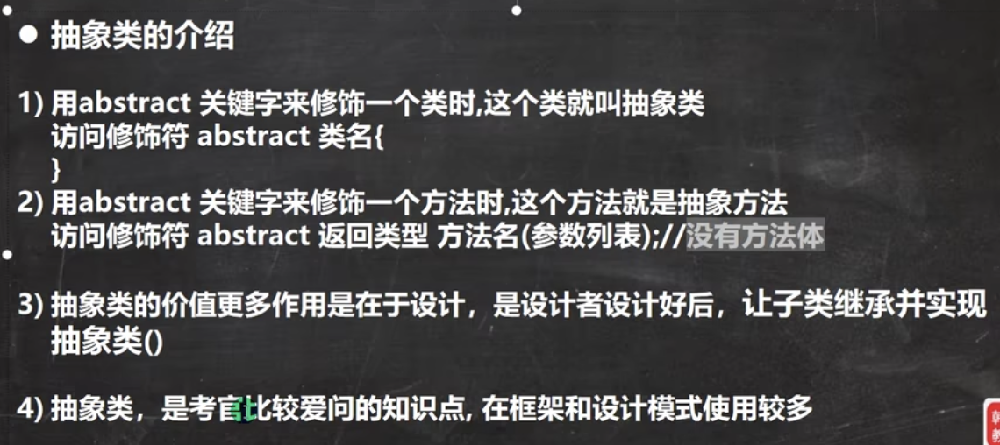

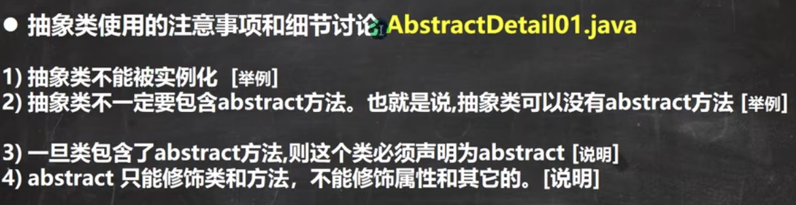

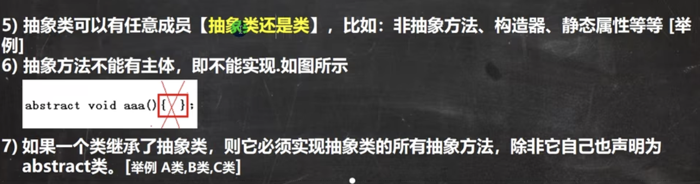

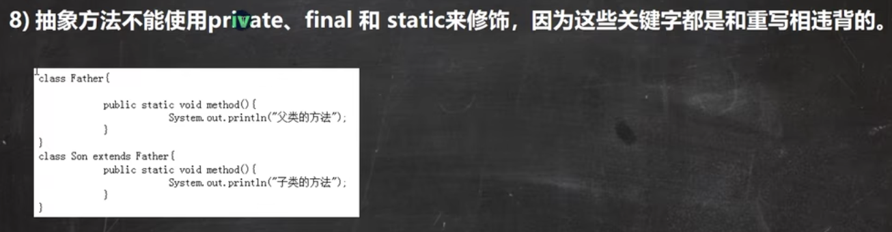

私有的方法不能被重写。

私有方法不能被重写或重载，因为私有方法是在类内部被定义和实现的，只能在本类中被访问。子类无法继承私有方法，因此也就无法对其进行重写或重载。在Java中，重载是指在同一个类中定义多个方法，方法名相同但参数列表不同。重写是指子类继承父类的方法，方法名、参数列表以及返回值类型都必须与父类方法相同，但是子类可以重写父类的方法实现。因此，由于私有方法无法被子类继承和访问，也就无法进行重写和重载。如果在子类中定义了一个和父类中的私有方法相同的方法，那么这个方法只是一个新的方法，与父类中的私有方法没有任何关系。需要注意的是，子类可以定义一个和父类中私有方法签名相同的方法，但是这个方法并不是对父类中的私有方法的重写或重载，因为子类无法访问父类中的私有方法。