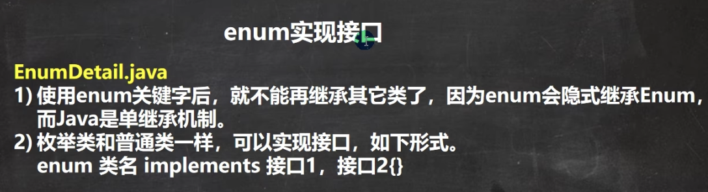

Java接口中的成员变量默认为(public、static、final)、方法为(public、abstract)

实现是java对单继承机制的一种补充。

当子类继承了父类，就自动拥有父类的功能，如果子类需要扩展功能，可以通过实现接口的方式拓展。

访问接口的x，就用A.x  
访问父类的x，就用super().x

getClass()获取运行类型的类名。

匿名内部类的用处是简化开发，当实现了某个接口的类只用一次时，就可以使用匿名内部类来简化。（基于接口的匿名内部类）  
或者当继承了某个类的类只用一次时，就可以使用匿名内部类来简化。（基于类的匿名内部类）

行参列表会传递给父类的构造器。

