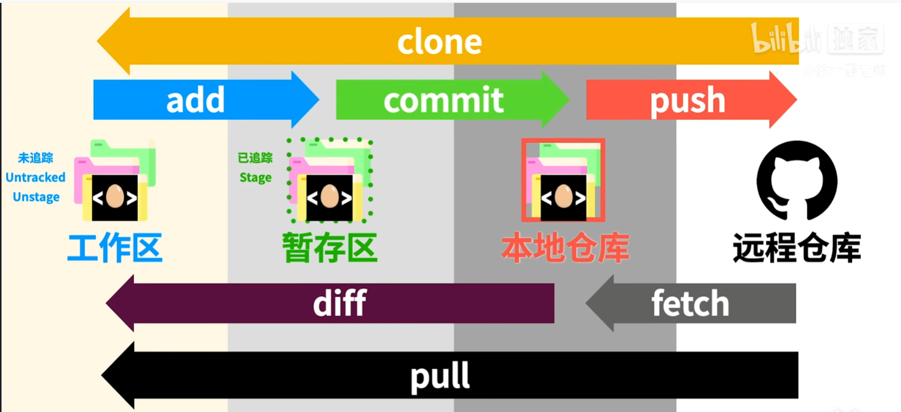
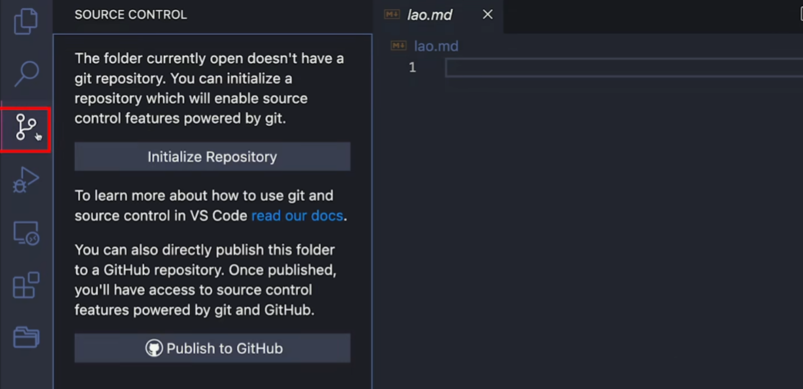
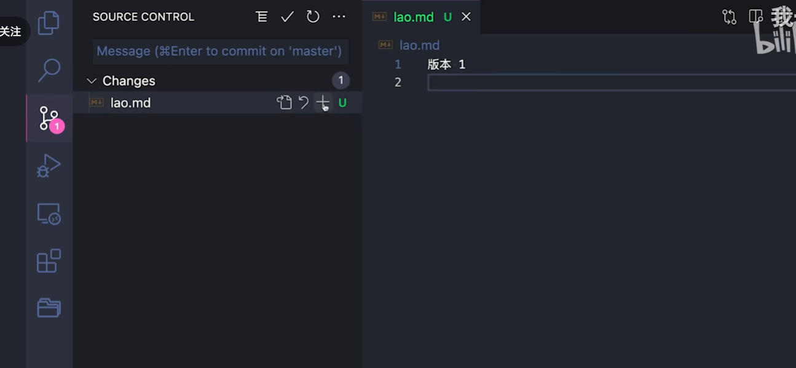
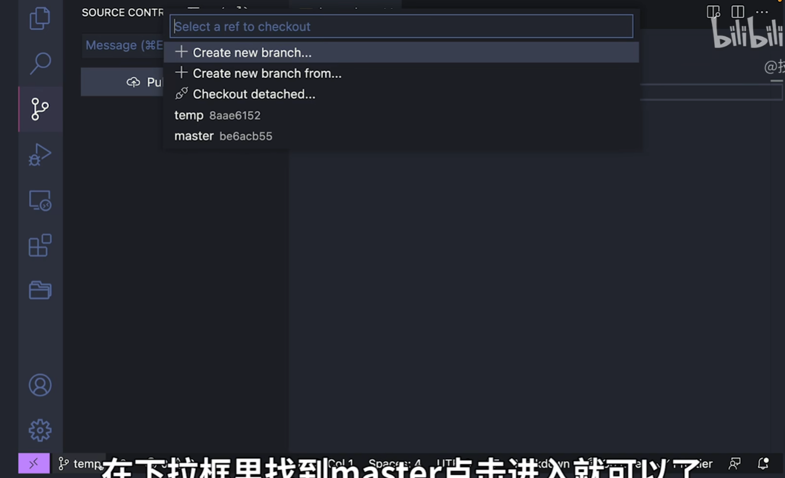
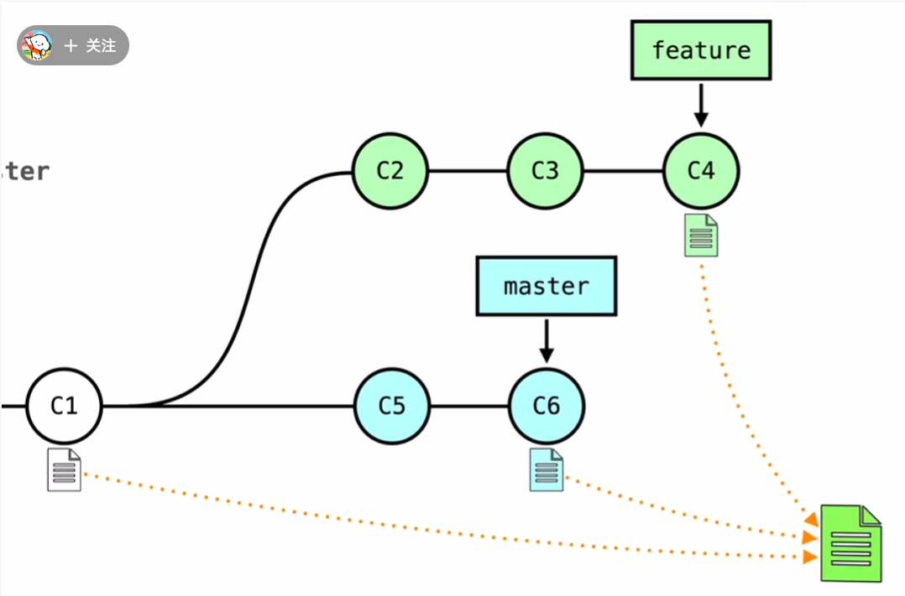
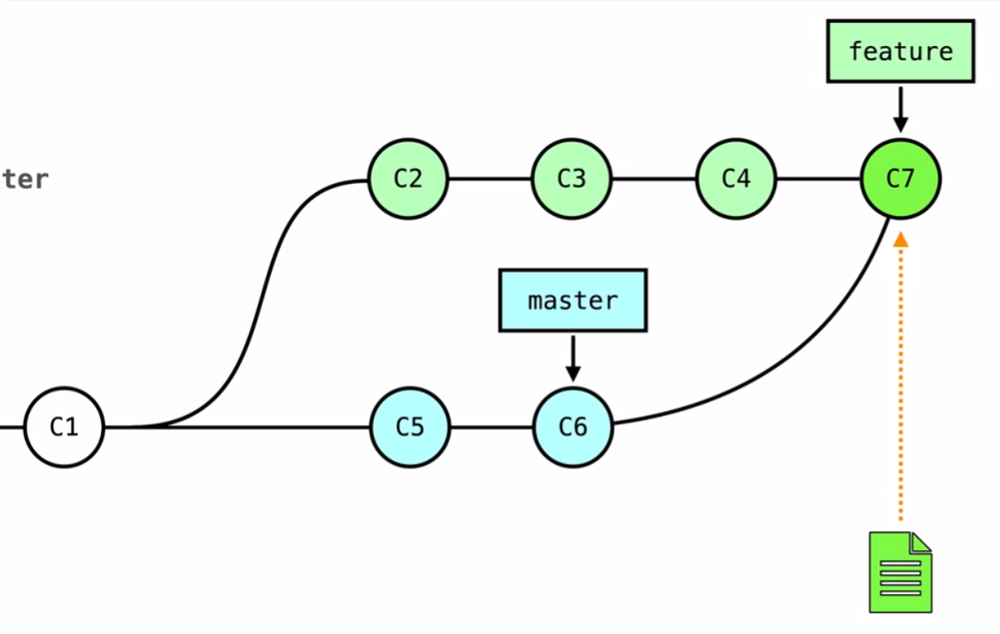
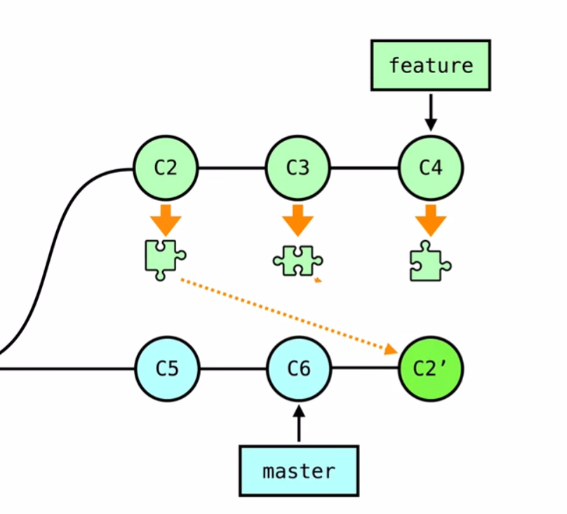
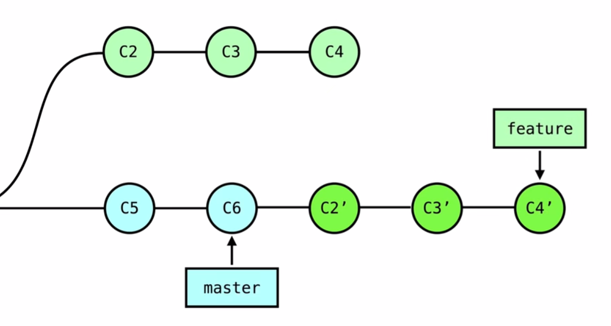
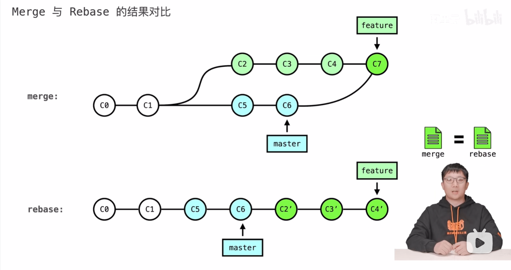

设置用户名和邮箱  
git config --global user.name "cwt"  
git config --global user.email 2039994970@qq.com

告诉git这个文件夹需要版本控制  
git init

查看状态  
git status

提交到暂存区  
git add

提交到本地仓库  
git commit -m "first commit"

查看commit的历史记录  
git log

创建.gitignore文件，并在其中写入想要忽略的文件的名字，这样即使这个文件在文件夹中，git status也不会显示它untrack了

创建新分支，创建新分支时会从当前所在的分支复制一份，并将其作为新的分支
git branch main

切换分支
git checkout main

add和commit一起执行  
git commit -am "first commit"  

删除分支  
git branch -d main  
git branch -D main （强制删除）

创建新分支并且马上切换到新分支  
git checkout -b main

把别的分支main合并到当前所处的分支  
git merge main

遇到冲突时需要自己修改文本处理，或者用一些merge工具处理

在github上一开始的主支名字叫main，而直接在本地使用git的话主支名字默认叫master

查看本地仓库和哪些远程仓库有联系  
git remote -v

origin默认表示远程仓库的名字

git push后输入用户名，然后不要输密码，把token粘贴过去

Initialize Repository相当于git init

+相当于git add  
-相当于git restore --staged <文件名>取消放到暂存区  
U表示untracked  
A表示已被添加到暂存区
右上角的✔相当于commit  
右上角三个点可以创建分支，合并分支 
M表示modified被修改的状态

左下角切换分支  
Publish Branch相当于git push

将本地仓库与远端仓库建立一个链接，一般将shortname设置为origin  
git remote add <shortname> <url>

git push origin <本地分支>:<远程分支>

如果本地分支与远程分支名字相同，可以省略冒号  
git push origin <分支名>

如果本地版本与远程版本有差异，但又要强制推送可以使用 --force 参数  
git push --force origin <分支名>

显示本地所有分支关联的远程分支  
git branch -vv

pull request 让别人拉取自己代码的请求

**在feature分支上 git merge master**

**在feature分支上 git rebase master**

