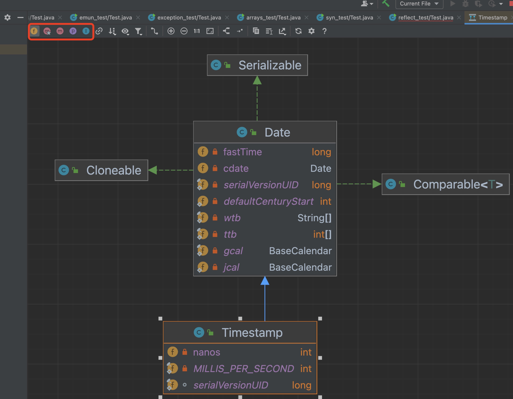

快捷键：
1. 双击  选中一个单词
2. ctrl + alt + l  格式化
3. ctrl + alt + t  surround with
4. ctrl + d  复制一行
5. ctrl + x  删除一行
6. ctrl + h  查看继承关系
7. ctrl + o  重写或实现方法
8. ctrl + p  查看方法需要传递什么参数
9. ctrl + /  单行注释（取消注释同理//）
10. ctrl + shift + /  多行注释（/* */）
11. /** + enter  生成文档注释
12. ctrl + shift + f  全项目搜索
13. ctrl + 单击  查看源码
14. ctrl + r 替换 ctrl + f 搜索
15. ctrl + alt + right  回到下一个方法（类）
16. ctrl + alt + left  回到上一个方法（类）
17. ctrl + alt + 单击  查看所有子类（或实现类）
18. Shift + enter  在当前行之下创建一个空白行（与光标当前位置无关）,并把光标移到行首
19. shift + tab  集体左移（tab集体右移）
20. alt + enter  智能提示
21. alt + insert  生成构造器getter，setter（mac版command + n）

快速生成代码段：
1. main  main方法
2. sout  输出
3. psf  public static final
4. .var  自动分配变量
5. itit  迭代器遍历
6. fori  for循环
7. I  增强for循环（iter，.for）
8. .sout  控制台输出
9. obj.if  等同于if(obj){}
10. obj.null  等同于if(obj == null){}

debug：
1. step over  逐行执行  
2. step into  进入方法体内  
3. force step into  强制进入方法体内  
4. step out  跳出方法  
5. resume  执行到下一个断点  
6. 蓝条的意思是执行到哪一行（这行之前执行过了，这行还未执行） 

diagrams:

1. space  搜索添加类  
2. 从左往右依次是：字段 构造器 方法 properties（getter，setter的字段） 内部类  
3. 常用  

idea设置：
1. 自动导包  
2. 代码提示补全  
3. debug设置  

mac快捷键：
1. 文字剪切 command + x 然后 command + v粘贴
2. 文件剪切 command + c 然后 command + option + v粘贴
3. 显示隐藏文件 command + shift + .
4. 聚焦搜索 command + space
5. 快速预览 单击 + space
6. 终端中断执行 command + . https://support.apple.com/zh-cn/guide/terminal/trmlshtcts/mac
7. 终端删除行 control + u
8. 终端重新定位插入点 在按住 Option 键的同时将指针移到新的插入点
9. 访达打开一个新窗口 command + n
10. 框选截图 command + shift + 4 （+control 放到剪贴板中）
11. 截图 command + shift + 4 (+ control 放入剪贴板)
