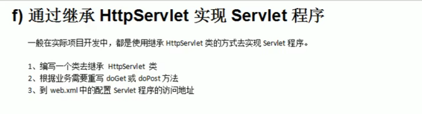
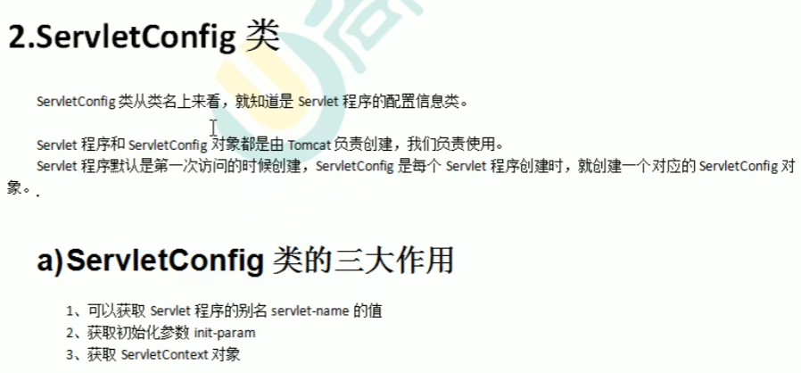
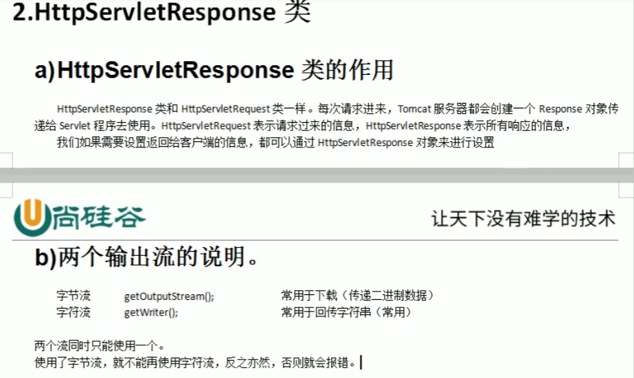

servlet是运行在Web服务器中的小型Java程序。servlet通过HTTP接收和响应来自Web客户端的请求。

JavaWeb三大组件：Servlet程序、Filter过滤器、Listener监听器。

请求的分发处理

请求的转发是指，服务器收到请求后，从一个资源跳转到另一个资源的操作。

cookie的值可以唯一地标识客户端，因此cookie常用于会话管理。

**Cookie是保存在客户端，Session是保存在服务端**

Session技术，底层其实是基于Cookie技术来实现的。

