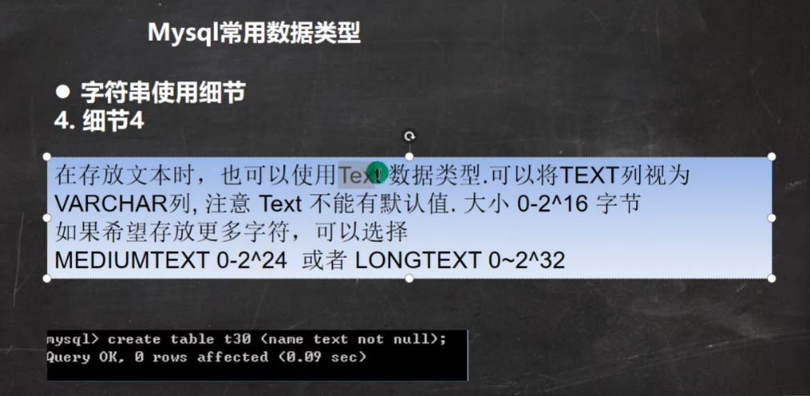
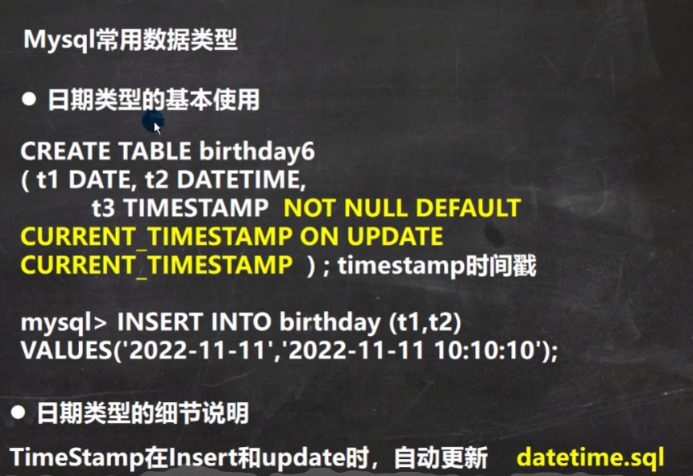
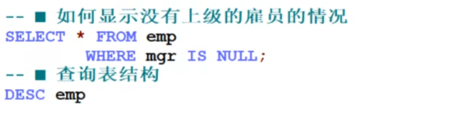

\` \`是为了规避关键字。

如果没有指定unsigned，则就是有符号。

255是字符，0-65535指的是字节，不同编码下每个字符占多少字节是不确定的。size是规定字符数。

注意null不等于''（空字符串）

不等于可以用<>或!=

BETWEEN...AND...是闭区间

CURRENT_TIMESTAMP和NOW效果一样。

DUAL是亚元表，可以用于测试。

UNIX_TIMESTAMP()返回的是1971-1-1到现在的秒数。

多表查询的条件不能少于表的个数-1，否则会出现笛卡尔集。

自查询：一张表可以当成两张表来用，需要给表取别名，AS可以省略。

可以把子查询当作一个临时表来使用。

