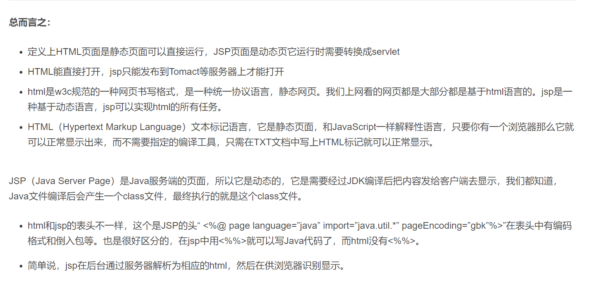
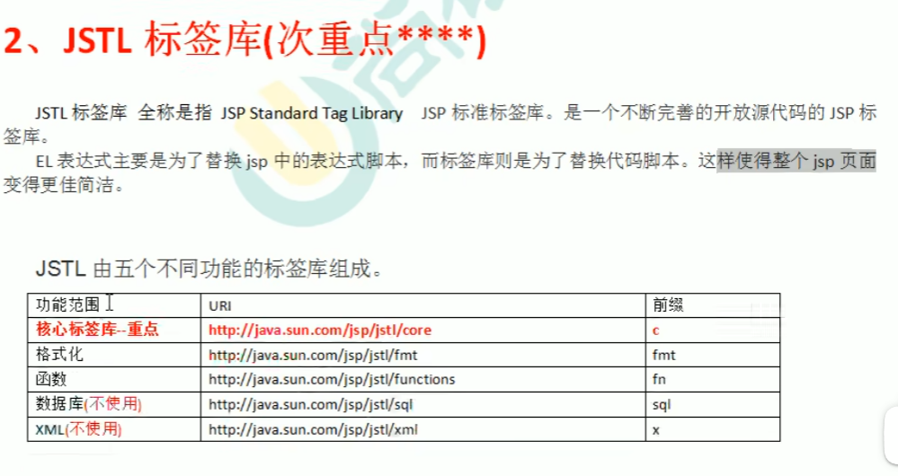

前端技术：HTML，CSS，JavaScript（JQuery），Ajax（可用原生JavaScript实现，也可用JQuery封装实现）

后端技术：Servlet，JSP（EL表达式，JSTL标签库），Filter，Listener

为什么不把页面的数据验证（比如检验用户名和密码的格式等操作）交给服务器用Java代码来操作，而是用JavaScript在客户端操作。因为这样可以减少服务器端压力。

**JQuery是JavaScript的一个类库。**

servlet是运行在Web服务器中的小型Java程序。servlet通过HTTP接收和响应来自Web客户端的请求。

JavaWeb三大组件：Servlet程序、Filter过滤器、Listener监听器。

Node.js是一种基于JavaScript语言的后端开发框架，它可以在服务器端运行JavaScript代码，因此被广泛应用于Web应用程序的开发中。虽然JavaScript最初是一种前端开发语言，但是随着Node.js的出现，JavaScript已经成为了一种全栈开发语言。

Ajax与Axios的区别：
1. axios是通过Promise实现对ajax的一种封装，就跟query对ajax的封装一样。ajax实现了局部数据的刷新，axios实现了对ajax的封装。
2. axios是ajax，ajax不止axios，简单来说：ajax包含axios。
3. ajax针对MVC编程，axios符合现在前端MVVM的模式。

Axios的优点：
1. 支持 Promise API，符合最新的ES规范
2. 转换请求和响应数据，自动转换JSON数据
3. 因为是基于Promise实现的，异步模型友好，可以使用Async/await

Ajax的缺点：
1. JQuery整个项目太大，单纯使用ajax却要引入整个JQuery非常的不合理
2. 基于原生的XHR开发，XHR架构本身不清晰
3. 基于事件的异步模型不友好